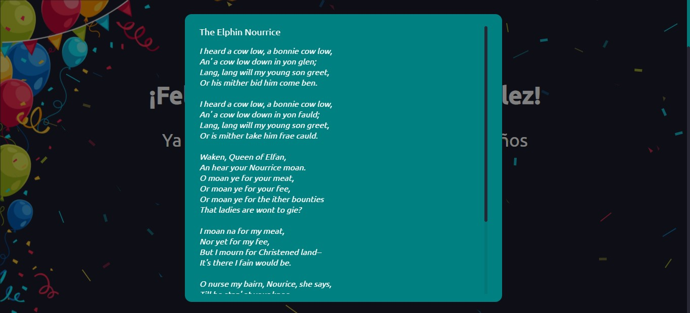

# :tada: Poetic Birthday Countdown UI 
Angular client for Poetic Birthday Countdown REST API.
Interface for seeing days until birthday or a random poem if it's your birthday.

This project was generated with [Angular CLI](https://github.com/angular/angular-cli) version 10.0.6.

REST API: [https://github.com/ariana-gonzalez/poetic-birthday-countdown](https://github.com/ariana-gonzalez/poetic-birthday-countdown)

## :rocket: To run it:
npm intall

Run `ng serve` for a dev server. Navigate to `http://localhost:4200/`. The app will automatically reload if you change any of the source files.

Once ran it can be accessed in the following link:
[http://localhost:4200/](http://localhost:4200/)

NOTE: The REST API ([https://github.com/ariana-gonzalez/poetic-birthday-countdown]) must be running for it to function. For instructions got to the repository's README.md

## :wrench: Requirements:
Angular CLI: 10.0.6
Node: 12.18.2

## :white_check_mark: Version:
Last version available in branch master.

## :sos: Further help

To get more help on the Angular CLI use `ng help` or go check out the [Angular CLI README](https://github.com/angular/angular-cli/blob/master/README.md).

Made with :sparkling_heart:

